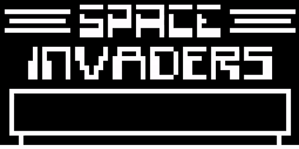

# Chip-8 Emulator
A cross-platform [Chip-8](https://en.wikipedia.org/wiki/CHIP-8) emulator written in C++. This project uses a custom "game" engine that I wrote for emulation using [SDL2](https://www.libsdl.org/) (Simple DirectMedia Layer). This project also uses my own low-level sound generation code that implements a square wave, which is used by Chip-8 as the computer's "buzzer".

## Background Information
Chip-8 is an interpreted programming language that was first implemented in the mid-1970s as a means of developing games for low-spec computers that are also portable. Chip-8 programs (games) run on a virtual machine.

## Examples
### Space Invaders


### Breakout


## Usage
This project makes use of one external dependency to handle interfacing with platform specific API calls [SDL2](https://www.libsdl.org/). You must have this installed in order to compile this project.

Once SDL2 is installed, you will be able to execute the following command:

`sh compile.sh`

This command will generate a `main` executable file in the root directory.

Next, download publically available `.ch8` ROM files you would like to play and put them into the `roms` directory.
> I recommend looking for 'space invaders', 'tetris', and 'breakout'.

Once you have the `main` executable created and you have some ROMs in the `roms` directory, execute the following command to load the rom and start playing:

`./main <filename.ch8>`

## Controls
Chip-8 implementations makes use of a very strange key layout that was representative of DIY low-spec computers of the time. Instead of having a QWERTY style keyboard that we are familiar with today, computers that implemented Chip-8 used a 16-key keyboard. This 16-key keyboard represents a nibble's worth of storage space, representing 0 to 15 (or 0 to f) in hex.

The keyboard layout this implementation of Chip-8 is labeled `Emulator` in following diagram.

```
 Original              Emulator

 1 2 3 C               1 2 3 4
 4 5 6 D               Q W E R
 7 8 9 E               A S D F
 A 0 B F               Z X C V
```